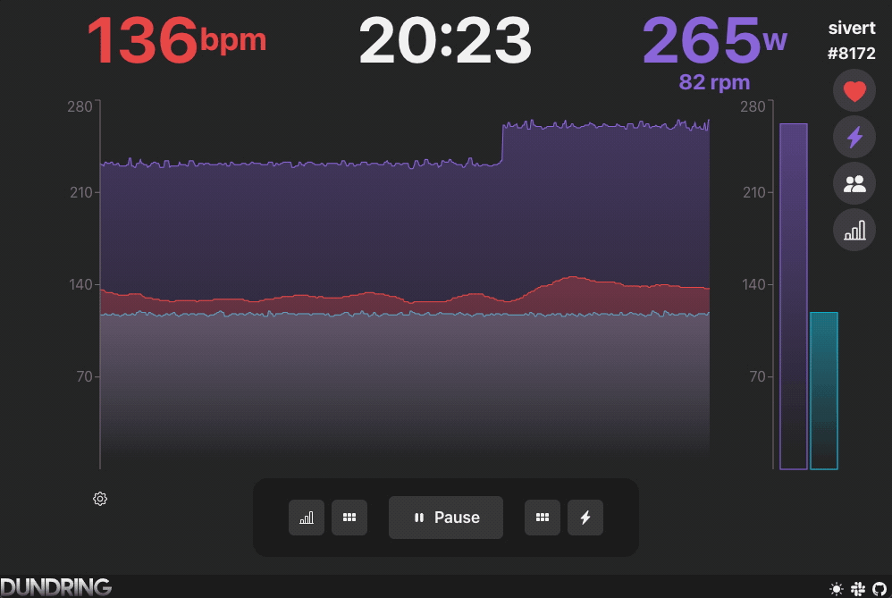
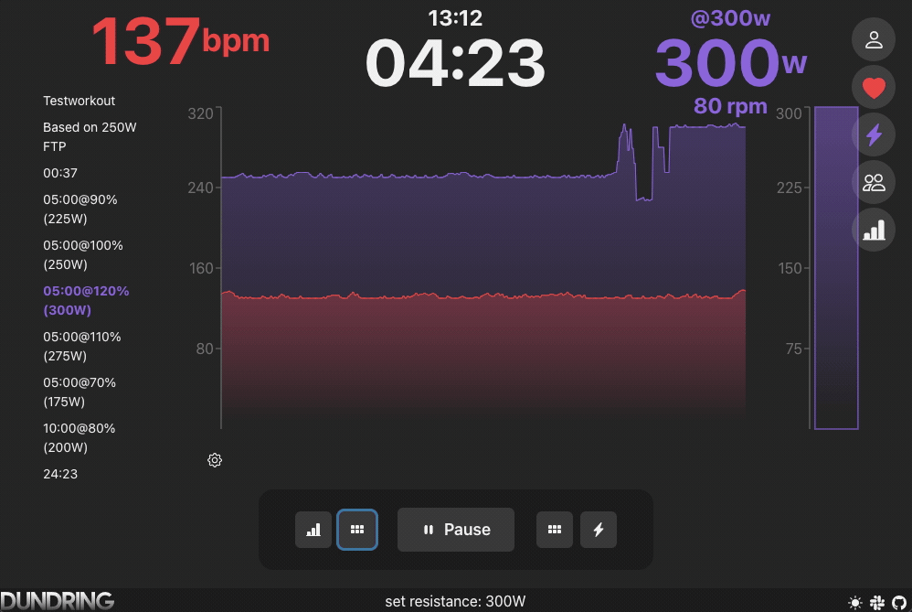
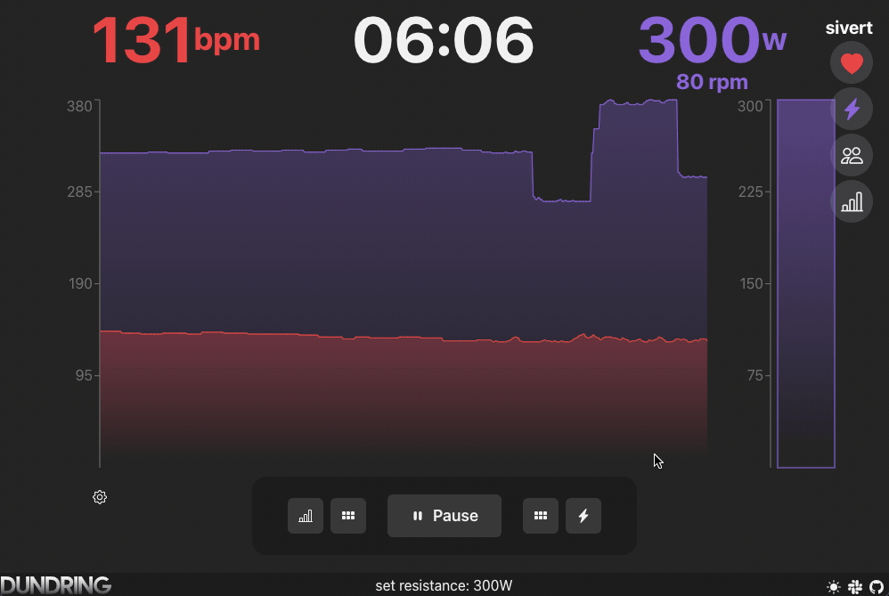
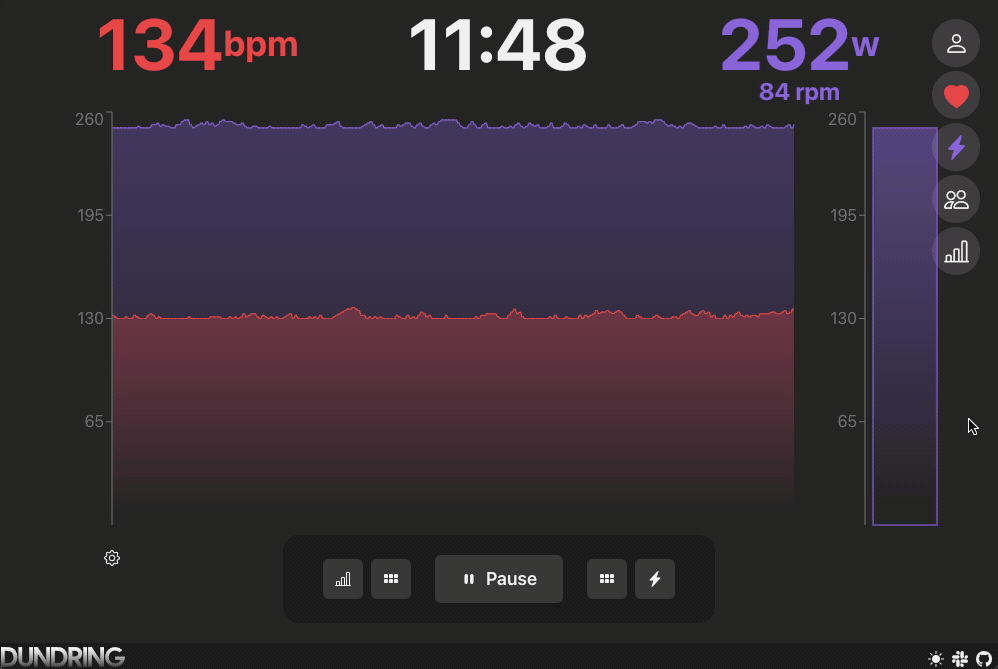
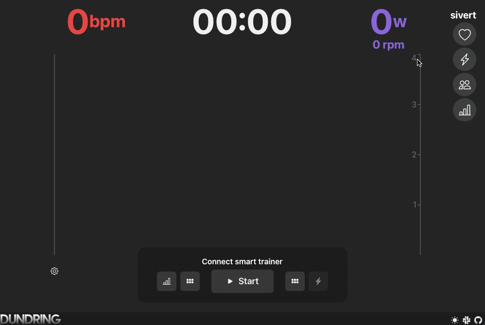

**[dundring.com](https://dundring.com) is an in-browser training application created to control and track your training with a smart bike trainer.**

**dundring.com is available at [https://dundring.com](https://dundring.com) ⚡️**



#### Main features

- **Bluetooth** - connect to smart bike trainers and heart rate monitors over Bluetooth.
- **ERG mode training** - controlling the resistance of your smart trainer.
- **Workout editor** - create and share workouts using the workout editor.
- **Group sessions** - train with a group of people and see each other's workout data live.

### Controlling the power

dundring.com can control your smart trainer's resistance, giving you the option to set the resistance as you go, or to create a workout program, which will set the resistance at given intervals.

#### Controlling the resistance manually


#### Controlling the power with workouts



### Training data

dundring.com currently records power and cadence from you smart trainer, and heart beats per minute from your heart rate monitor. When you're done with your workout, you can download the workout data as a .TCX-file, which can be uploaded to your favorite training diary program, such as [Strava](https://www.strava.com/).



### Creating workout

You can predefine your workouts by using the workout editor. A workout is multiple parts that describe a given target power and a duration. The workouts are based on the active FTP provided, which means that the workout will be saved with parts containing a duration and percent of FTP. This means that as your FTP gets higher, all you have to do is to adjust your FTP on dundring.com, to get the same effort out of your workouts. This functionality makes sharing the workout with a friend easier, and they will get the same effort based on their FTP.



### Group sessions

You can create or join a group session to workout together with your friends.



## Development

The project is separated into `frontend` and `backend`, with more in-depth instructions in each directory. The frontend is created with [React](https://reactjs.org/), [TypeScript](https://www.typescriptlang.org/) and [Chakra-UI](https://chakra-ui.com/), and the backend is created with [Express](https://expressjs.com/) and [TypeScript](https://www.typescriptlang.org/).

Install dependencies and do the required config. `.env` files with empty values are generated in `apps/frontend`, `apps/backend` and `libs/database`. The application will use the default local config if no value is provided in `.env`, except for the Strava config; if you want to do testing with the Strava integration, you have to provide your own client id and client secret. You can get your personal client credentials by configuring an app here [https://www.strava.com/settings/api](https://www.strava.com/settings/api).

```
$ yarn
```

You can either run both the frontend and backend in parallel, or separately.

### In parallel

```bash
# start database and redis
$ docker compose up -d

# start the app
$ yarn start
```

If you would like to get mocked HR and Power data, you can run the app with

```
$ yarn mock
```

### Separately

```
# Run the frontend
$ yarn frontend

# Run the frontend with mock-data
$ yarn frontend:mock

# Run the backend
$ yarn backend
```

## Contribution

Feel free to create issues and pull requests - or join our [Slack workspace](https://join.slack.com/t/dundring/shared_invite/zt-10g7cx905-6ugYR~UdMEFBAkwdSWOAew) if you have questions, feedback or feature requests! 🤠
